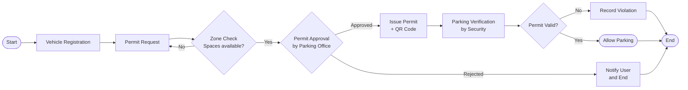

# Task 2 — Workflow Diagram

The diagram below shows the end-to-end workflow of the Digital Parking Permit System,
from a user registering a vehicle through to security verification on campus.

## Workflow Steps

```
Vehicle Registration  →  Permit Request  →  Zone Check  →  Permit Approval  →  Parking Verification
```

## Mermaid Flowchart (renders inline on GitHub)



## How to Recreate in diagrams.net

1. Open <https://app.diagrams.net/>
2. Choose **Create New Diagram → Blank Diagram**
3. Drag five rectangles onto the canvas, left-to-right, and label them:
   - Vehicle Registration
   - Permit Request
   - Zone Check
   - Permit Approval
   - Parking Verification
4. Add a diamond (decision shape) after **Zone Check** (Spaces available? Yes / No)
5. Add a diamond after **Permit Approval** (Approved / Rejected)
6. Add a diamond after **Parking Verification** (Valid / Invalid)
7. Connect the shapes with arrows following the flow above
8. Export as **PNG** and save it as `diagrams/workflow_diagram.png`

## Description of Each Step

| Step | Actor | Action |
|------|-------|--------|
| Vehicle Registration | Student / Staff | Submits vehicle details (plate, make, model, owner ID) |
| Permit Request | Student / Staff | Chooses permit type and preferred parking zone |
| Zone Check | System | Confirms the chosen zone has free spaces |
| Permit Approval | Parking Office | Reviews and approves or rejects the permit request |
| Parking Verification | Security Staff | Scans plate / QR code on campus to confirm a permit is valid |
